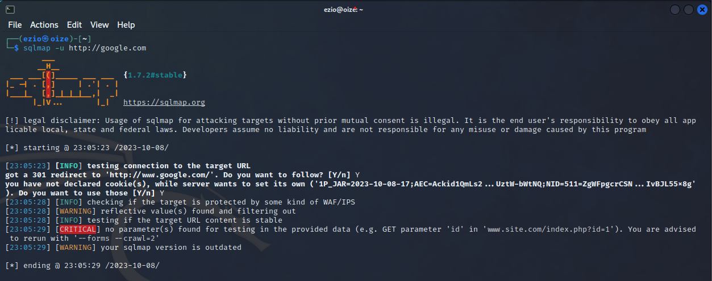

# Contributor
Intern ID : HPTI-SEP23-027

## Usage

| Name  | Usage  | Link  |
|-------|--------|-------|
| SqlMap | Automated SQL injection detection and exploitation. | [Link](https://www.kali.org/tools/sqlmap/) |


## Introduction

`sqlmap` is a powerful tool for automated SQL injection detection and exploitation. Using it in a single line depends on the specific command and parameters you want to use.

## Installation

To install the `sqlmap` use the following commands.

Note: Please note that these commands are considered for systems based on Debian Linux.

```bash
sudo apt install sqlmap
```


## Documentation

```bash
       __H__
 ___ ___["]_____ ___ ___  {1.7.2#stable}
|_ -| . [)]     | .'| . |
|___|_  [']_|_|_|__,|  _|
      |_|V...       |_|   https://sqlmap.org

Usage: python3 sqlmap [options]

Options:
  -h, --help            Show basic help message and exit
  -hh                   Show advanced help message and exit
  --version             Show program's version number and exit
  -v VERBOSE            Verbosity level: 0-6 (default 1)

  Target:
    At least one of these options has to be provided to define the
    target(s)

    -u URL, --url=URL   Target URL (e.g. "http://www.site.com/vuln.php?id=1")
    -g GOOGLEDORK       Process Google dork results as target URLs

  Request:
    These options can be used to specify how to connect to the target URL

    --data=DATA         Data string to be sent through POST (e.g. "id=1")
    --cookie=COOKIE     HTTP Cookie header value (e.g. "PHPSESSID=a8d127e..")
    --random-agent      Use randomly selected HTTP User-Agent header value
    --proxy=PROXY       Use a proxy to connect to the target URL
    --tor               Use Tor anonymity network
    --check-tor         Check to see if Tor is used properly

  Injection:
    These options can be used to specify which parameters to test for,
    provide custom injection payloads and optional tampering scripts

    -p TESTPARAMETER    Testable parameter(s)
    --dbms=DBMS         Force back-end DBMS to provided value

  Detection:
    These options can be used to customize the detection phase

    --level=LEVEL       Level of tests to perform (1-5, default 1)
    --risk=RISK         Risk of tests to perform (1-3, default 1)

  Techniques:
    These options can be used to tweak testing of specific SQL injection
    techniques

    --technique=TECH..  SQL injection techniques to use (default "BEUSTQ")

  Enumeration:
    These options can be used to enumerate the back-end database
    management system information, structure and data contained in the
    tables

    -a, --all           Retrieve everything
    -b, --banner        Retrieve DBMS banner
    --current-user      Retrieve DBMS current user
    --current-db        Retrieve DBMS current database
    --passwords         Enumerate DBMS users password hashes
    --dbs               Enumerate DBMS databases
    --tables            Enumerate DBMS database tables
    --columns           Enumerate DBMS database table columns
    --schema            Enumerate DBMS schema
    --dump              Dump DBMS database table entries
    --dump-all          Dump all DBMS databases tables entries
    -D DB               DBMS database to enumerate
    -T TBL              DBMS database table(s) to enumerate
    -C COL              DBMS database table column(s) to enumerate

  Operating system access:
    These options can be used to access the back-end database management
    system underlying operating system

    --os-shell          Prompt for an interactive operating system shell
    --os-pwn            Prompt for an OOB shell, Meterpreter or VNC

  General:
    These options can be used to set some general working parameters

    --batch             Never ask for user input, use the default behavior
    --flush-session     Flush session files for current target

  Miscellaneous:
    These options do not fit into any other category

    --wizard            Simple wizard interface for beginner users

```

## Basic Usage

To start using `sqlmap`, follow these simple steps:

Open your terminal.

Run `sqlmap` with the following command:

```bash
sqlmap -u <target-URL>
```
You can replace <target-URL> with the website URL you want to scan.

#### Example:


